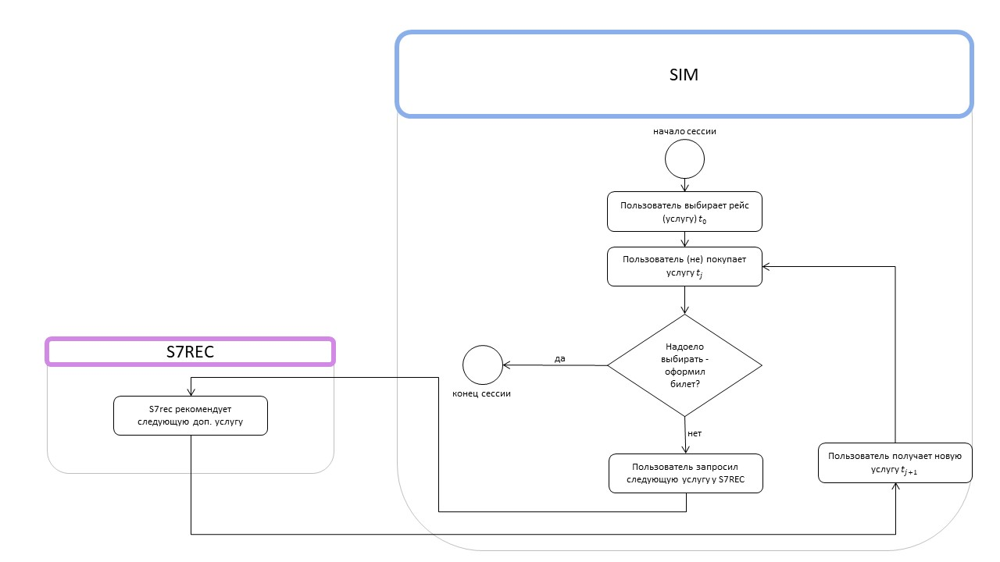

# Курсовой проект по предмету "Создание прототипов авиационных аналитических систем" 

### Общее описание задачи

Пользователи приходят на страницу бронирования **s7rec**, чтобы купить билет на самолёт.
Сперва пользователь сам выбирает направление куда он хочет полететь.
Когда пользователь выбрал это направление, сервис рекомендует дополнительные услуги к направлению.
Пользователь может купить рекомендованную услугу или перейти к следующей.
Либо пользователю может надоесть и он закончит бронирование и уйдет.
Как поступит пользователь зависит от качества рекомендаций: если они плохие - пользователь быстро уйдет; если хорошие –
будет тратить много денег.
Последовательность купленных пользователем услуг мы будем называть "сессией".
На диаграмме ниже показан процесс одной сессии.  

Цель сервиса **s7rec** – максимально много вытрясти денег у пользователя.
Сервис меряет прибыль с каждого трека из сессии и суммирует эти проценты, чтобы получить общую сумму выручки (пренебрегаем тем, что услуги могут стоить разное количество денег).

### Что есть в репозитории

#### s7rec

В этом модуле лежит прототип сервиса рекомендера. 

[Описание и инструкции](s7rec/README.md)

#### sim

Так как рекоммендер учебный он не развернут для реальных пользователей. 
Для этого в модуле sim реализован симулятор пользователя.
Запуская симулятор, мы генерируем трафик, похожий на трафик, который генерируют реальные пользователи.

[Описание и инструкции](sim/README.md)

