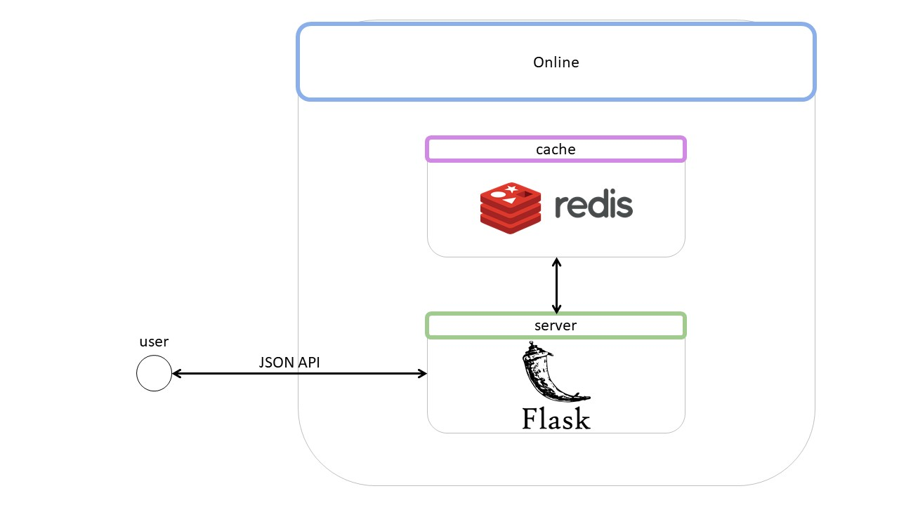

# Модуль S7REC

Сервис рекомендаций реализован как приложение на [Flask](https://flask-restful.readthedocs.io/en/latest/).
Это приложение умеет обрабатывать запросы по REST API.
В качестве in-memory кэша используется [Redis](https://redis.io/).
Приложение пишет лог событий в json в папку `/app/log/`



## Инструкция

1. [Устанавливаем docker](https://www.docker.com/products/docker-desktop)
2. Собираем образы и запускаем контейнеры
   ```
   docker-compose up -d --build 
   ```   
3. Смотрим логи рекомендера
   ```
   docker logs recommender-container
   ```
4. Останавливаем контейнеры
   ```
   docker-compose stop
   ```

## Полезные команды
Проверяем, что сервис жив
```
curl http://localhost:7777/
```
Запрашиваем информацию по услуге
```
curl http://localhost:7777/service/12
```
Запрашиваем следующий трек
```
curl -H "Content-Type: application/json" -X POST -d '{"track":10,"time":0.3}'  http://localhost:5000/next/1
```
Завершаем пользовательскую сессию
```
curl -H "Content-Type: application/json" -X POST -d '{"service":10,"revenue":0.3}'  http://localhost:7777/last/1
```
Скачиваем логи сессий
```
docker cp recommender-container:/app/log/ /tmp/
```

Зайти внутрь Redis-контейнера
```
docker exec -it redis-container  bash
```

Посмотреть число баз в redis-cli

```
INFO keyspace
```